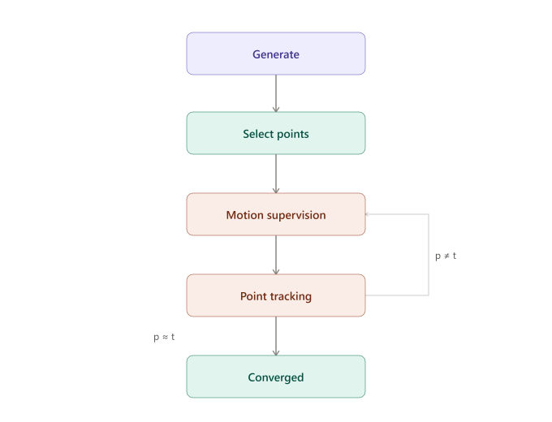

# DragGAN-Flax  

[](https://github.com/google/jax)
[](https://flax.readthedocs.io/en/latest/nnx/index.html)
[](https://www.python.org/)
[](LICENSE)
[](https://arxiv.org/pdf/2305.10973)

A from-scratch implementation of [DragGAN](https://arxiv.org/pdf/2305.10973) — *Interactive Point-based Manipulation on the Generative Image Manifold* — built in JAX and Flax NNX.

<!--  -->

---

## What is DragGAN?

DragGAN lets you manipulate a generated image by placing **handle points** on it and dragging them toward **target points**. Rather than warping pixels in the way an image editor would, DragGAN navigates the GAN's generative manifold — so dragging a nose rightward turns the whole face, dragging a mouth corner downward produces a natural expression change, and so on. Image identity and visual quality are preserved throughout.

This implementation reproduces the core optimization loop entirely in Flax NNX, on top of a pretrained StyleGAN2 generator.

---

## How It Works



1. **Generate** — Sample a latent `z`, map it to a disentangled `W+` code via the StyleGAN2 mapping network, and synthesize an image.
2. **Select** — The user places one or more handle–target point pairs on the image, and optionally draws a mask marking the region allowed to change.
3. **Motion Supervision** — Optimize the first six layers of `W+` so that the generator's feature-map patches around each handle point are pulled one step closer to the target, using a masked L1 objective. Gradient is not propagated through the source patch term, only through the interpolated target — consistent with the paper's formulation.
4. **Point Tracking** — Re-localize each handle point by nearest-neighbor search within a local feature-space window, using the **original** feature at each point as a fixed reference throughout the session.
5. **Repeat** until each handle point is within threshold distance of its target.

---

## Project Structure

```
DragGAN-JAX/
├── src/
│   ├── drag_gan.py              # DragGan module: motion supervision, point tracking, optimization loop
│   ├── style_gan2_generator.py  # StyleGAN2 mapping + synthesis networks in Flax NNX
│   └── utils.py                 # helpers
├── test/                        # Unit tests
├── docs/                        # Diagrams and write-ups
├── requirements.txt
└── LICENSE
```

---

## Installation

Requires **Python ≥ 3.11** (JAX 0.10.x dropped support for earlier versions).

```bash
git clone https://github.com/<your-username>/DragGAN-JAX.git
cd DragGAN-JAX
python -m venv .venv && source .venv/bin/activate
pip install -r requirements.txt
```

For GPU support, install the CUDA-enabled JAX build matching your driver before running the above — see the [official JAX installation guide](https://docs.jax.dev/en/latest/installation.html).

---

## Key Implementation Details

| Component | Detail |
|---|---|
| **Generator** | StyleGAN2 synthesis network, rewritten in Flax NNX to expose intermediate block feature maps |
| **Latent space** | W+ optimization — 18 layers, first 6 updated per step, remaining frozen |
| **Feature block** | Configurable; default block 6, as used in the paper |
| **Motion supervision** | Patch-wise L1 loss over a `(2r₁+1)²` neighborhood; shifted target obtained via bilinear interpolation; stop-gradient applied to source patch |
| **Mask preservation** | L1 discrepancy between current and original feature maps, gated by the complement of the user mask, normalized by spatial extent and added with λ=20 |
| **Point tracking** | Nearest-neighbor search over a `(2r₂+1)²` window in feature space; reference feature fixed to the session-start value at each original handle location |
| **Vectorization** | Both motion supervision and point tracking operate on a batched `(n_points, 2r+1, 2r+1)` grid — no Python-level loops over points or patch elements |
| **Optimizer** | Adam via `optax`, `lr=1e-3`, with gradient clipping for stability |

---

## Roadmap

- [x] StyleGAN2 generator in Flax NNX with accessible intermediate feature maps
- [x] Feature map quality investigation
- [x] Motion supervision loss, validated to update `W+`
- [x] Point tracking algorithm
- [x] Combined optimization step (motion supervision + tracking)
- [x] Multi-point support with fully vectorized patch operations
- [x] Mask preservation loss
- [ ] Interactive GUI
- [ ] GAN inversion — support for user-uploaded images


---

## Citation

```bibtex
@inproceedings{pan2023draggan,
  title     = {Drag Your GAN: Interactive Point-based Manipulation on the Generative Image Manifold},
  author    = {Pan, Xingang and Tewari, Ayush and Leimk\"uhler, Thomas and Liu, Lingjie and Meka, Abhimitra and Theobalt, Christian},
  booktitle = {ACM SIGGRAPH 2023 Conference Proceedings},
  year      = {2023}
}
```

---

## Acknowledgements

- [Pan et al., "Drag Your GAN"](https://arxiv.org/pdf/2305.10973) — original paper
- [flaxmodels](https://github.com/matthias-wright/flaxmodels) — base StyleGAN2 JAX/Flax port and pretrained weights